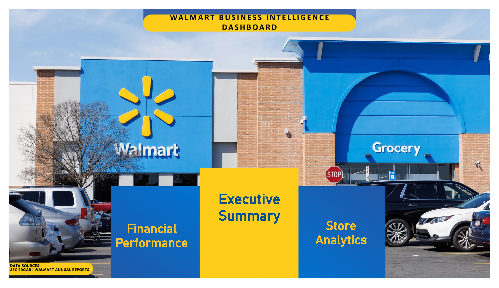
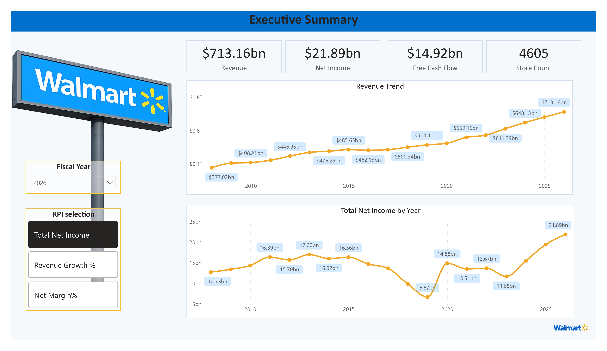
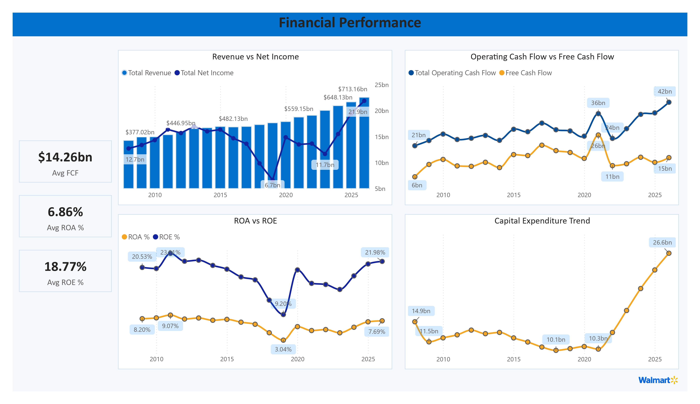
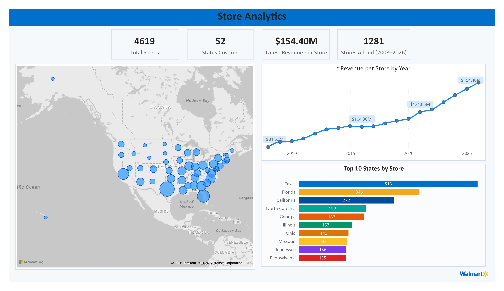

# 🛒 Walmart Financial & Store Footprint Analytics


An end-to-end data analytics project that combines **Walmart's SEC financial statements** with **historical U.S. store footprint data** to evaluate long-term financial performance, operational efficiency, and retail expansion between **fiscal years 2008–2025**.

The project features a custom Python ETL pipeline, automated SEC EDGAR data extraction, financial KPI engineering, and an interactive Power BI dashboard designed to answer business-focused questions.

---

# Dashboard Preview

## Home



---

## Executive Summary



---

## Financial Performance



---

## Store Analytics



---

# Business Problem

Walmart has consistently expanded its retail footprint while growing into one of the world's largest retailers.

This project investigates several business questions:

- Did revenue grow faster than store expansion?
- Did each Walmart store become more productive over time?
- How did profitability evolve alongside expansion?
- Which U.S. states have the highest Walmart concentration?

---

# Project Highlights

- Built a custom ETL pipeline using the SEC EDGAR Company Facts API
- Automated extraction and cleaning of Walmart financial statements
- Combined financial data with historical U.S. store footprint data
- Engineered business KPIs using Python and DAX
- Designed a multi-page interactive Power BI dashboard
- Performed financial validation against Walmart annual reports

---

# Tech Stack

| Category | Technologies |
|-----------|--------------|
| Programming | Python |
| Data Processing | Pandas |
| API | SEC EDGAR Company Facts API |
| BI Tool | Power BI |
| Data Modeling | Power Query, DAX |
| Version Control | Git & GitHub |

---

# Repository Structure

```text
walmart-financial-footprint-analytics/
├── README.md
├── LICENSE
├── data/
│   ├── raw/
│   └── processed/
├── scripts/
├── powerbi/
├── images/
└── docs/
```

---

# Data Pipeline

A custom ETL pipeline was developed to automate financial data collection and preparation rather than relying on static datasets.

### Extraction

- Retrieved Walmart financial statements from the SEC EDGAR Company Facts API
- Extracted seven key financial metrics:
  - Revenue
  - Net Income
  - Operating Cash Flow
  - Capital Expenditure
  - Diluted EPS
  - Total Assets
  - Stockholders' Equity

### Transformation

- Filtered annual (`10-K`) filings
- Removed duplicate filings while preserving the earliest reported values
- Standardized fiscal-year reporting periods
- Merged financial metrics into a unified analytical dataset
- Integrated historical Walmart store counts

### Validation

The processed dataset was validated against Walmart's FY2026 Annual Report.

- Revenue matched reported values
- Diluted EPS matched reported values
- Minor differences in Net Income and earlier Revenue values were investigated and documented as SEC restatements and noncontrolling-interest reporting differences.

Additional details are available in:

```
docs/methodology_notes.md
```

---

# Dashboard Pages

## Home

- Project overview
- Dashboard navigation
- Executive summary

---

## Executive Summary

- Revenue KPI
- Net Income KPI
- Free Cash Flow KPI
- Total Store Count
- Revenue Trend
- Net Income Trend
- KPI Selector
  - Revenue Growth %
  - Net Margin %

---

## Financial Performance

- Revenue vs Net Income
- Operating Cash Flow vs Free Cash Flow
- ROA vs ROE
- Capital Expenditure Trend

---

## Store Analytics

- Walmart Store Distribution Map
- Top 10 States by Store Count
- Revenue per Store Trend

---

# KPIs

The dashboard includes the following business metrics:

- Revenue
- Net Income
- Revenue Growth %
- Net Profit Margin
- AVG Return on Assets (ROA)
- AVG Return on Equity (ROE)
- Operating Cash Flow
- AVG Free Cash Flow
- Capital Expenditure
- Revenue per Store
- Store Count

---

# Key Insights

- Revenue increased from **$377.02B (2008)** to **$713.16B (2026)**, representing approximately **89% growth**, while store count increased by only about **38%**. This suggests revenue growth was driven more by higher store productivity than rapid expansion.

- Revenue generated per store nearly doubled during the analysis period, increasing from **$81.62M** to **$154.40M**.

- Revenue remained relatively stable over time, while profitability metrics such as Net Income, ROA, and ROE experienced greater volatility before recovering in recent years.

- Walmart's U.S. footprint is concentrated in the South and Southeast, led by **Texas (513 stores)** and **Florida (346 stores)**.

- Capital expenditure remained relatively consistent for over a decade before increasing significantly in recent years, indicating renewed investment in operations and infrastructure.

---

# Data Sources

### Financial Data

- SEC EDGAR Company Facts API

### Store Data

- Public Walmart U.S. store location dataset

### Historical Store Counts

- Historical Walmart U.S. store count records

---

# Getting Started

Clone the repository:

```bash
git clone https://github.com/kappsdue/walmart-financial-footprint-analytics.git
```

Open the Power BI dashboard:

```
powerbi/Walmart_Financial_Analytics.pbix
```

---

# Notes

- Financial statements were retrieved from the SEC EDGAR Company Facts API.
- Historical store count and store location data originate from publicly available datasets.
- Minor financial discrepancies observed across reporting years are documented in `docs/methodology_notes.md`.
- Executive Summary and Store Analytics use different store datasets, which may result in slight differences in reported store counts.

---

# 👤 Author

**Kaustubh**

If you found this project useful or interesting, feel free to connect with me or explore my other repositories.

⭐ If you like this project, consider starring the repository.
